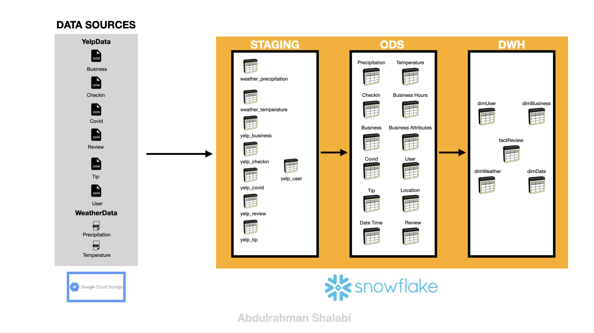

# 🛠️ Yelp & Weather Data Analytics Pipeline

## 📌 Table of Contents
- [Project Overview](#-project-overview)
- [Data Sources](#-data-sources)
- [Architecture](#-architecture)
- [Prerequisites](#-prerequisites)
- [Setup Instructions](#%EF%B8%8F-setup-instructions)
- [ETL Process](#-etl-process)
- [Data Model](#-data-model)
- [Example Queries](#-example-queries)
- [Contributing](#-contributing)
- [License](#-license)

---

## 🚀 Project Overview
This project establishes a **data pipeline** to ingest, transform, and analyze **Yelp business data** and **weather data** using Snowflake. The pipeline follows a multi-layered architecture (`STAGING → ODS → DWH`) to structure raw data into actionable insights. Key features include:
- **GCS Integration**: Seamless ingestion from Google Cloud Storage.
- **Data Transformation**: JSON/CSV files → structured tables.
- **Dimensional Modeling**: Analytics-ready star schema in the DWH layer.

---

## 📂 Data Sources
1. **Yelp Datasets** (JSON):
   - `Business`, `Checkin`, `Covid`, `Review`, `Tip`, `User`.
2. **Weather Datasets** (CSV):
   - `Precipitation`, `Temperature`.

---

## 🏗️ Architecture
### Data Flow
1. **STAGING Layer**: Raw data loaded into staging tables from GCS.
2. **ODS Layer**: Normalized relational tables with constraints.
3. **DWH Layer**: Dimensional models (star schema) for analytics.



---

## 🔧 Prerequisites
- **Snowflake Account** with `ACCOUNTADMIN` privileges.
- **GCS Buckets**:
  - `gcs://snowflackbucketgcps` (CSV files).
  - `gcs://snowflakebucketgcpjsons` (JSON files).
- Basic knowledge of **Snowflake SQL** and **GCP integrations**.

---

## ⚙️ Setup Instructions

### 1. Initialize Database and Schemas
```sql
USE ROLE ACCOUNTADMIN;
CREATE DATABASE IF NOT EXISTS yelp_weather_insights;
CREATE SCHEMA IF NOT EXISTS STAGING;
CREATE SCHEMA IF NOT EXISTS ODS;
CREATE SCHEMA IF NOT EXISTS DWH;
ALTER WAREHOUSE COMPUTE_WH SET WAREHOUSE_SIZE = 'XSMALL';

```

## 2. Integrate with GCP

```sql
CREATE STORAGE INTEGRATION gcp_integration
  TYPE = EXTERNAL_STAGE
  STORAGE_PROVIDER = GCS
  ENABLED = TRUE
  STORAGE_ALLOWED_LOCATIONS = (
    'gcs://snowflackbucketgcps',
    'gcs://snowflakebucketgcpjsons'
  );
```
## 3. Create File Formats and Stages

### CSV Format
```sql
CREATE OR REPLACE FILE FORMAT YELP_WEATHER_INSIGHTS.STAGING.fileformat_gcp
  TYPE = CSV
  FIELD_DELIMITER = ','
  SKIP_HEADER = 1;
```
# JSON Format

```sql
CREATE OR REPLACE FILE FORMAT YELP_WEATHER_INSIGHTS.STAGING.JSONFORMAT
  TYPE = JSON;
```

# Stages

```sql
CREATE OR REPLACE STAGE YELP_WEATHER_INSIGHTS.STAGING.stage_gcp
  STORAGE_INTEGRATION = gcp_integration
  URL = 'gcs://snowflackbucketgcps'
  FILE_FORMAT = fileformat_gcp;

CREATE OR REPLACE STAGE YELP_WEATHER_INSIGHTS.STAGING.JSONSTAGE
  STORAGE_INTEGRATION = gcp_integration
  URL = 'gcs://snowflakebucketgcpjsons'
  FILE_FORMAT = JSONFORMAT;
```

# 4. Execute Table Creation Scripts

Run the SQL scripts in this order:

1. **STAGING Tables**: Load raw data  
2. **ODS Transformations**: Normalize data  
3. **DWH Models**: Build dimensional tables  

---

## 🔄 ETL Process

| Layer    | Key Steps                                                                 |
|----------|---------------------------------------------------------------------------|
| STAGING  | COPY INTO from GCS, JSON parsing, type conversions (e.g., `to_timestamp_ntz`) |
| ODS      | Normalization, PK/FK constraints, data cleansing (e.g., split checkin dates) |
| DWH      | Star schema models (`dimBusiness`, `factReview`, `dimWeather`)            |

---

## 📊 Data Model

### Key Tables by Layer

| Layer    | Tables                                      |
|----------|---------------------------------------------|
| STAGING  | `YELP_BUSINESS`, `YELP_REVIEW`, `WEATHER_PRECIPITATION`, `YELP_USER` |
| ODS      | `business`, `user`, `temperature`, `precipitation`, `review` |
| DWH      | `dimBusiness`, `dimUser`, `factReview`, `dimWeather` |

---

## 🔍 Example Queries

### 1. Top 10 Businesses by Reviews

```sql
SELECT name, review_count 
FROM dimBusiness 
ORDER BY review_count DESC 
LIMIT 10;
```
### 2. Weather Impact on Daily Reviews

```sql
SELECT w.date, COUNT(r.review_id) AS total_reviews
FROM factReview r
JOIN dimWeather w ON r.date = w.date
GROUP BY w.date;
```

## Abdulrahman Shalabi 
